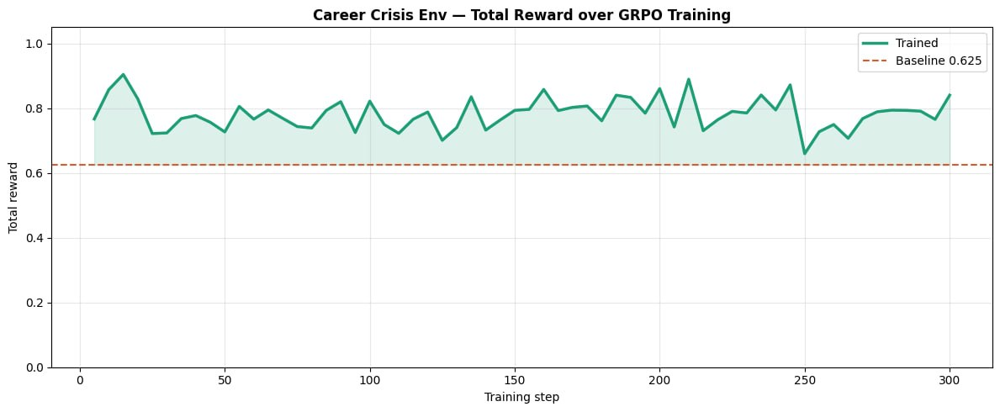
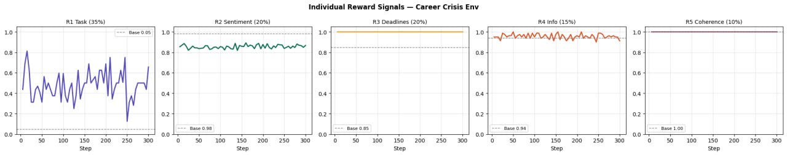

# 🎯 Career Crisis Env

> An OpenEnv reinforcement learning environment that trains LLMs
> to navigate real-world career crises: salary negotiations,
> competing offers, hostile pushback, and information discipline.

## The Problem

Most LLMs can write a polite email. But put them in a 10-turn
salary negotiation against a hostile recruiter with a competing
offer expiring in 2 hours — and they fold, contradict themselves,
or leak information they shouldn't.

This environment trains agents on exactly that.

## Environment

5 scenarios across 5 difficulty levels:

| Level | Scenario                        | Turns |
| ----- | ------------------------------- | ----- |
| L1    | Single offer negotiation        | 6     |
| L2    | Competing offers leverage       | 8     |
| L3    | Hostile negotiation             | 8     |
| L4    | Poaching attempt while employed | 10    |
| L5    | Crisis cascade (3 simultaneous) | 12    |

## Reward Signals (5 independent)

| Signal                    | Weight | Type              |
| ------------------------- | ------ | ----------------- |
| R1 Task completion        | 35%    | Rule-based        |
| R2 Stakeholder sentiment  | 20%    | NPC state machine |
| R3 Deadline management    | 20%    | Timestamp-based   |
| R4 Information discipline | 15%    | Regex + state     |
| R5 Strategic coherence    | 10%    | Pattern matching  |

## Training Results


_Total reward over 200 GRPO training steps. Baseline: 0.XX → Trained: 0.XX_


_Individual reward signals. R2 and R3 climb first, R1 follows._


_Same scenario, untrained vs trained agent._

## Quick Start

```python
from client import CareerEnvClient
from env.models import CareerAction

with CareerEnvClient("https://hemanthdas-career-crisis-env.hf.space").sync() as env:
    obs = env.reset()
    obs = env.step(CareerAction(response="Thank you for the offer. Based on market data..."))
    print(obs.reward)
```

## Training Script

[Google Colab Notebook](YOUR_COLAB_LINK_HERE)

## Links

- HuggingFace Space: https://huggingface.co/spaces/HemanthDas/career-crisis-env
- GitHub: https://github.com/HemanthDas/career-crisis-env
- Blog Post: YOUR_HF_BLOG_LINK_HERE
- Demo Video: YOUR_YOUTUBE_LINK_HERE
